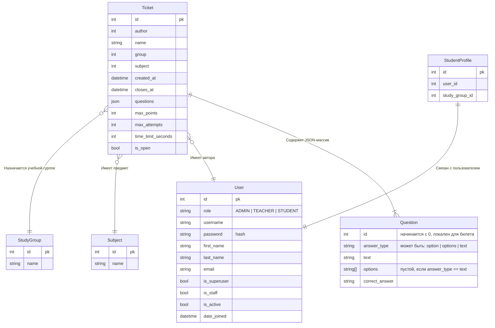

## Question
Question не является полноценной в базе данных, здесь описана схема JSON-объекта, массив из которых будет включен в поле `questions` каждого билета.

### Тип ответа
#### Из нескольких вариантов один правильный
`answer_type` = "option"
```json
[
    {
        "id": 0,
        "points": 1,
        "answer_type": "option", // может быть: option | options | text
        "text": "Сколько решений у квадратного уравнения x^2 = 9?",
        "options": [
            "1",
            "2",
            "3",
            "нет решений"
        ],
        "correct_answer": "2"
    }
]
```
#### Несколько из нескольких вариантов
`answer_type` = "options"

В этом случае `correct_answer` - массив из строчек правильных ответов.
```json
[
    {
        "id": 0,
        "points": 1,
        "answer_type": "options", // может быть: option | options | text
        "text": "Какие из перечеслинных чисел являются решениями уравнения x^2 = 9?",
        "options": [
            "1",
            "3",
            "4",
            "-3"
        ],
        "correct_answer": ["-3", "3"]
    }
]
```
#### Нет вариантов ответа
`answer_type` = "text"
```json
[
    {
        "id": 0,
        "points": 1,
        "answer_type": "text", // может быть: option | options | text
        "text": "Какое уравнение содержит неизвестную во второй степени? Ответ - одно слово в И.п.",
        "options": [], // пусто, так как тип ответа = text
        "correct_answer": "квадратное"
    }
]
```

> [!NOTE]
> TODO: Хранение и отдача utf-8 в JSONField questions. (нужно поставить ensure_ascii=False в каком-то месте😍)

## Пройденные билеты
CompletedTicket
- completed_at
- ticket_id
- user_id
- points
- JSON-массив answers
```json
[
    {
        "id": 0,
        "answer": "3"
    }
]
```
